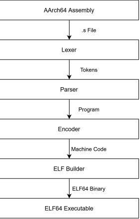

# ARM Assembler
[](https://en.wikipedia.org/wiki/C_(programming_language))
[](https://www.linux.org/)
[](https://developer.arm.com/Architectures/AArch64)
[](#Supported-Instructions)

A lightweight, zero-dependency AArch64 assembler written from scratch in C. It assembles AArch64 assembly source code directly into Linux ELF64 executables. which can then be executed on bare-metal hardware such as a Raspberry Pi or emulators like QEMU.

This is the next stage of my AArch64 toolchain. It builds on my last project: [CPU Simulator](https://github.com/BJL156/CPU-Simulator) by targeting a real ISA. While laying the foundation for my next project: [ARM C Compiler](https://github.com/BJL156/ARM-C-Compiler)

## Architecture
<p align="center">
  
</p>

### Lexer
Reads AArch64 assembly source code and converts it into a sequence of tokens. It handles whitespace, comments, directives, registers, immediates, mnemonics, and strings.

### Parser
Converts the tokens into a dynamic array of statements and builds a `Program` which contains the parsed assembly source. It handles directives, labels, instructions, and operands.

### Encoder
Converts parsed AArch64 instructions into their corresponding machine-code encodings. It handles 32 and 64 bit encodings.

### ELF Builder
Combines the encoded machine code and data with the required ELF64 headers to produce a Linux AArch64 ELF64.

## Build
> [!NOTE]
> **Needs to be built on Linux. For Windows, use WSL.**

Clone the repository and change into its directory:
```bash
git clone https://github.com/BJL156/ARM-Assembler
cd ./ARM-Assembler
```
Then use CMake:
```bash
cmake -B build
cmake --build build
```
The final executable will be written to: `./build/assembler`.

## Usage
```bash
./assembler <file.s> <output>
  <file.s>  AArch64 assembly source file.
  <output>  Output ELF64 executable.
```

## Example
### Input ([./asm/hello.s](https://github.com/BJL156/ARM-Assembler/blob/main/asm/hello.s))
```s
.global _start
.data
  msg: .asciz "Hello, world!\n"

.text
_start:
  adr x1, msg
  mov x2, #14
  mov x0, #1
  mov x8, #64
  svc #0

  mov x0, #0
  mov x8, #93
  svc #0
```
### Build and Run
```bash
# ARM Assembler:
$ ./build/assembler ./asm/hello.s ./build/hello.out

# Run:
$ ./build/hello.out
Hello, world!
$ echo $?
0
```

## Implemented AArch64 Instructions
| Category | Instructions |
|:----------|:------------|
| Data Movement | `mov`, `ldr`, `str`, `ldrb`, `strb`, `adr`, `ldp`, `stp`, `movk` |
| Arithmetic | `add`, `sub`, `mul`, `udiv`, `sdiv`, `neg` |
| Shift | `lsl`, `lsr`, `asr` |
| Bitwise | `and`, `orr`, `eor`, `mvn` |
| Branching | `b`, `bl`, `b.eq`, `b.ne`, `b.lt`, `b.le`, `b.gt`, `b.ge`, `b.hi`, `b.lo`, `b.hs`, `b.ls`, `b.mi`, `b.pl`, `ret`, `cbz`, `cbnz` |
| Comparison | `cmp` |
| System / Hints | `svc`, `nop` |

## Current Limitations
- Linux ELF64 output only.
- Small set of AArch64 instructions.
- No linker support (converts straight to an ELF64).
- Single-file assembly programs only.
